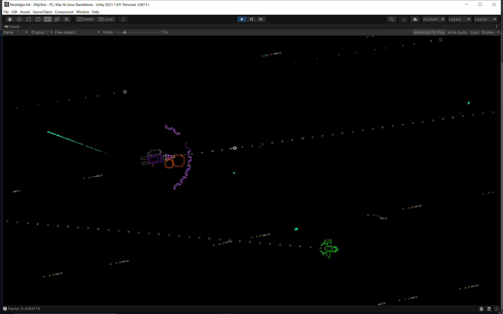

# Nostalgia 64 (Unity)

Precursor to Nostalgia 64 (Godot). Abandoned because I dislike Unity3D.

Since this project is older, it has had a lot more work done on it. Currently there are 8 ships - all of them fully implemented and functional.
